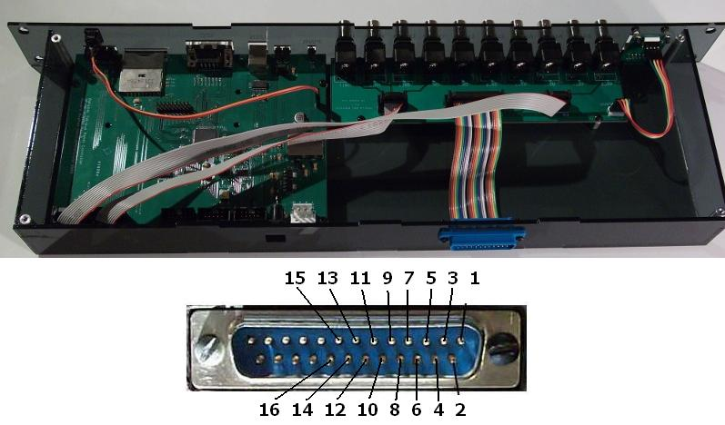

# Controller

Note: There is a new version of the panel controller in development right now, the new setup's changes are listed below.

- ADC0 now accepts Wing Beat Amplitude input to control X channel in modes 1 and 2. This input should be in the form of L-R. That is, with a negative gain in modes 1 and 2, a negative signal will cause a decrease in channel frame and a positive signal will cause an increase in channel frame number.
- ADC1 now accepts Wing Beat Amplitude input to control Y channel in modes 1 and 2. This will happen in the same manner as ADC0.
- ADC2 now sets the X position when the X mode is set to 3.
- ADC3 now sets the Y position when the Y mode is set to 3.

## Controller V 3.0 Connector functionalities list

- ADC0:   analog input in mode 1 and 2 of channel x;
- ADC1:   analog input in mode 1 and 2 of channel x
- ADC2:   analog input in mode 1 and 2 of channel y
- ADC3:   analog input in mode 1 and 2 of channel y
- ADC4:   analog input in mode 3 of channel x
- ADC5:   analog input in mode 3 of channel y

__Note__: Users can debug  ADC0 to ADC5 with command `Panel_com('adc_test', chan)` or `Panel_com('dio_test', chan)`

Users can also read analog input from ADC0 to ADC3 with command `Panel_com('get_adc_value', chan)`

- DAC0: update current frame number (in the unit of volt) in mode 1,2,3, 4, and PC dumping mode of channel x

update analog output in mode 5 (debugging function generator) of channel x;

output triangle wave pulse to a specific ADC port with command `Panel_com('adc_test', chan)`

- DAC1: update current frame number (in the unit of volt) in mode 1,2,3, 4, and PC dumping mode of channel y
  - update analog output in mode 5 (debugging function generator) of channel y;
  - output square wave pulse to a scope with command `Panel_com('dio_test', chan)`
  - output triangle wave pulse to a scope with command `Panel_com('adc_test', chan)`
- DAC2: unused
- DAC3: unused

__Note__: Users can update analog output from DAC0 to DAC3 with command `Panel_com('set_ao',[chan, val]);`

- Int0: laser trigger;
- Int1: timing for fetching and displaying each frame when controller works in default mode and PC dumping mode
- Int2: trigger camera;
- Int3: waiting for external trigger to start pattern display

__Note__: Users can debug int0 to int4 with command `Panel_com('dio_test', chan)`

# BNC Breakout

{:.ifr .pop}

The rear breakout connection of the panels controller can be used to utilize additional connections from the controller not present on the front of the controller.

| signal | 26pin header | 25pin D-sub (rear connector)|
|:------ |:------------:|:---------------------------:|
| 5V     |          1   |             13              |
| GND    |          2   |             25              |
| ADC0   |          3   |             12              |
| ADC1   |          4   |             24              |
| ADC2   |          5   |             11              |
| ADC3   |          6   |             23              |
| ADC4   |          7   |             10              |
| ADC5   |          8   |             22              |
| DAC0   |          9   |              9              |
| DAC1   |         10   |             21              |
| DAC2   |         11   |              8              |
| DAC3   |         12   |             20              |
| INT0   |         13   |              7              |
| INT1   |         14   |             19              |
| INT2   |         15   |              6              |
| INT3   |         16   |             18              |

# Project structure

The Eagle design files are inside the `eagle` folder, the production files are available in `gerber`.

The most recent production we are aware of was ordered by the Frye lab in August 2020 at [Bittele](https://7pcb.com). Feel free to use the reference number Q11396B in your communication with Bittele if you want to order the exact same Controller (`JF-MR-PC0003 RevC 2019_10_11`).

```sh
├── eagle
└── gerber
```
